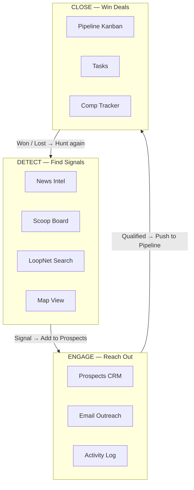
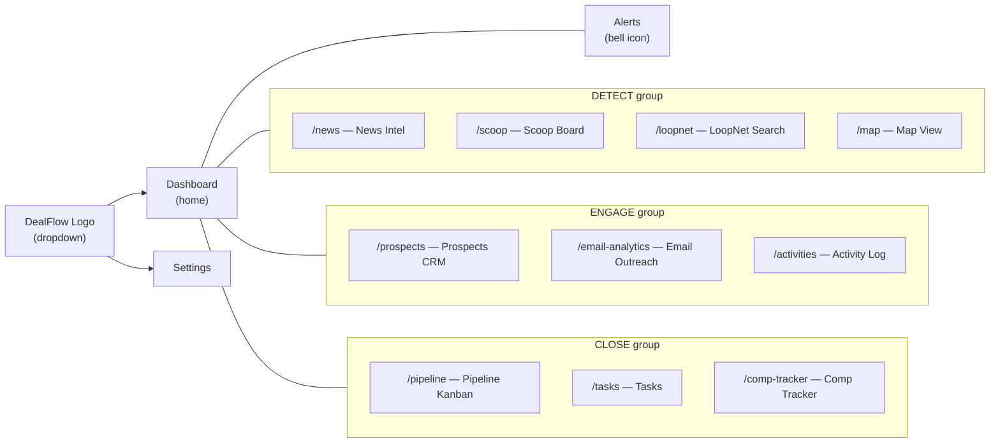
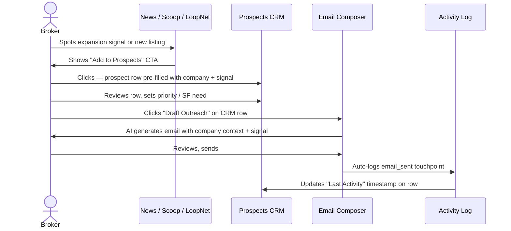
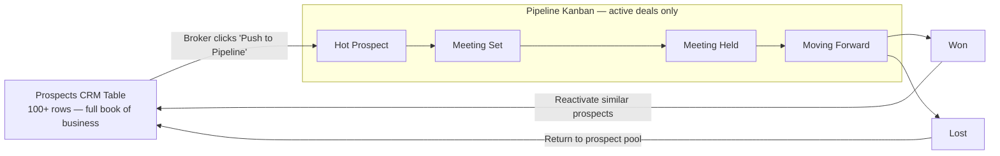
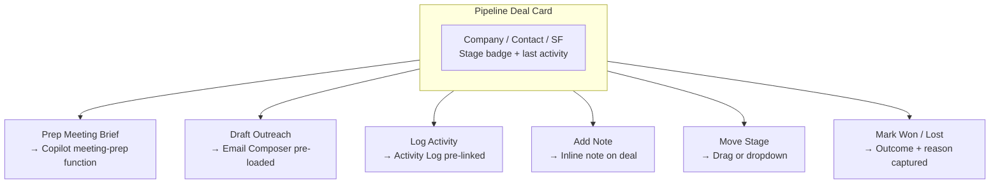
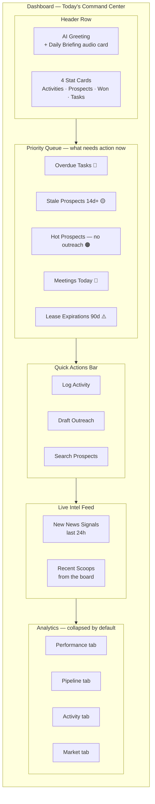
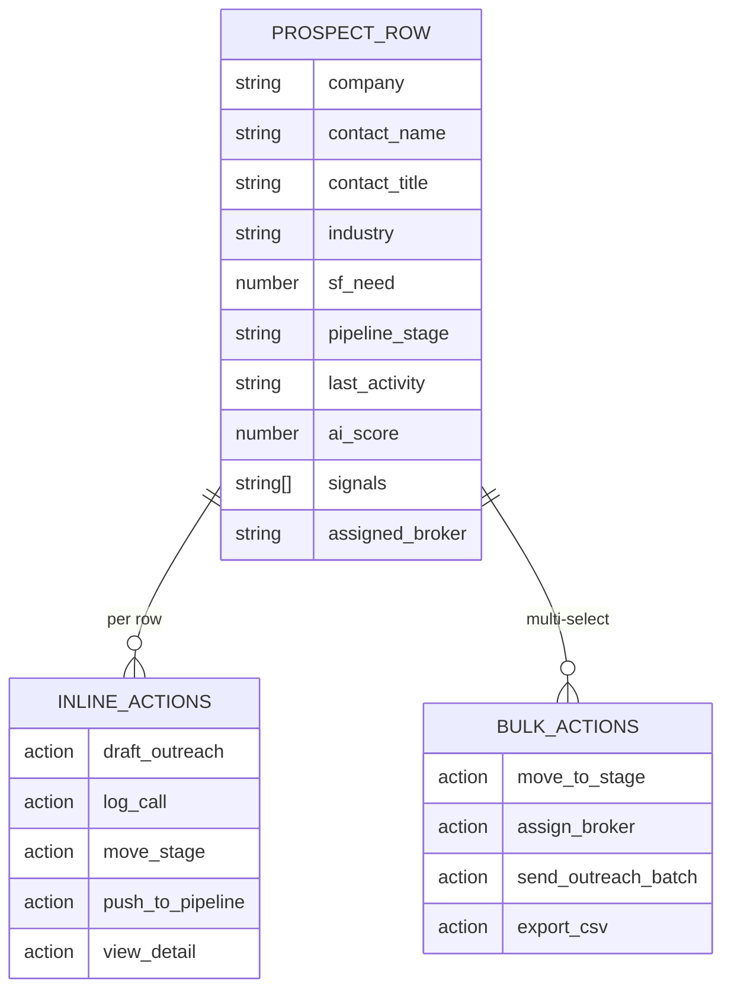
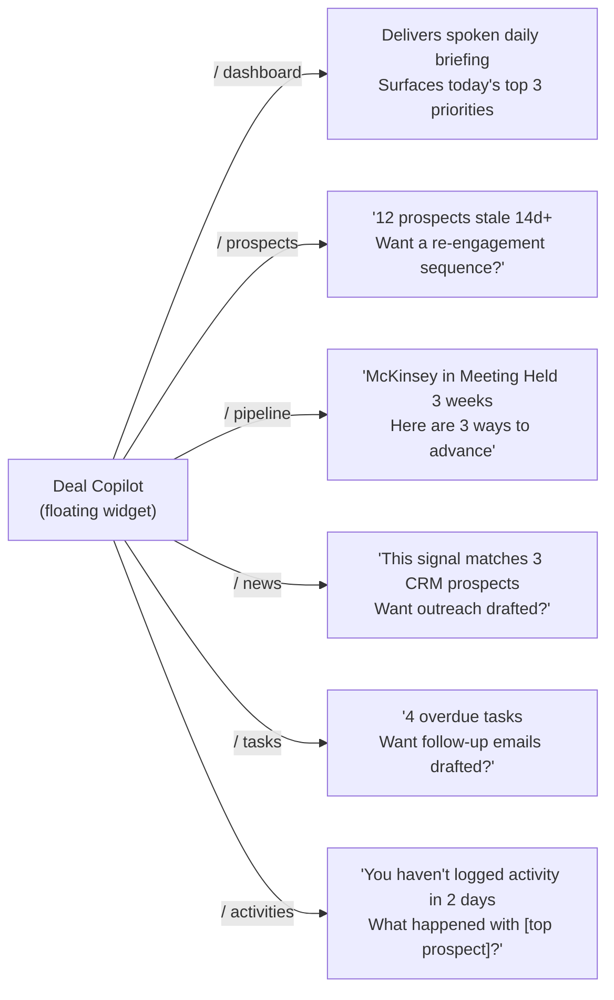
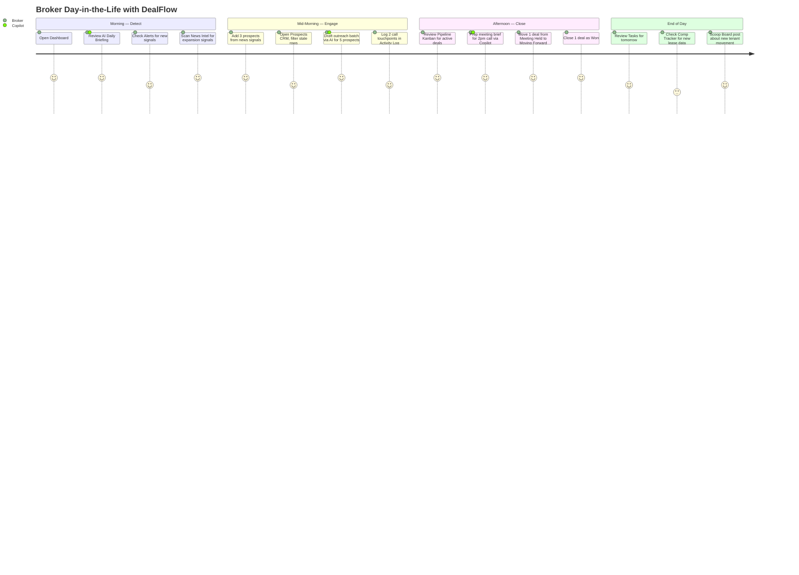

# DealFlow — UX Flow Diagrams

> Visual documentation of the proposed UX architecture and user journey flows.

---

## 1. Top-Level Workflow Loop

The three-phase broker workflow that drives the entire information architecture.

---

## 2. Navigation Architecture

How the new grouped navbar maps every page to a workflow phase.

---

## 3. Signal to Prospect Flow

How a broker turns a market signal into a tracked prospect.

---

## 4. Prospect CRM to Pipeline Flow

How a qualified prospect graduates into an active deal.

---

## 5. Pipeline Deal Actions Flow

What a broker can do at each stage of the Kanban.

---

## 6. Dashboard Command Center Layout

The proposed Dashboard structure — action-first, analytics second.

---

## 7. Prospect CRM Table — Data & Actions

Column structure and available actions on each row.

---

## 8. AI Copilot Context Awareness

How the Copilot behaves differently based on the current page.

---

## 9. Full User Journey — New Broker Day-in-the-Life

End-to-end journey showing how all phases connect in a real workday.

---

*DealFlow — Detect. Engage. Close.*
